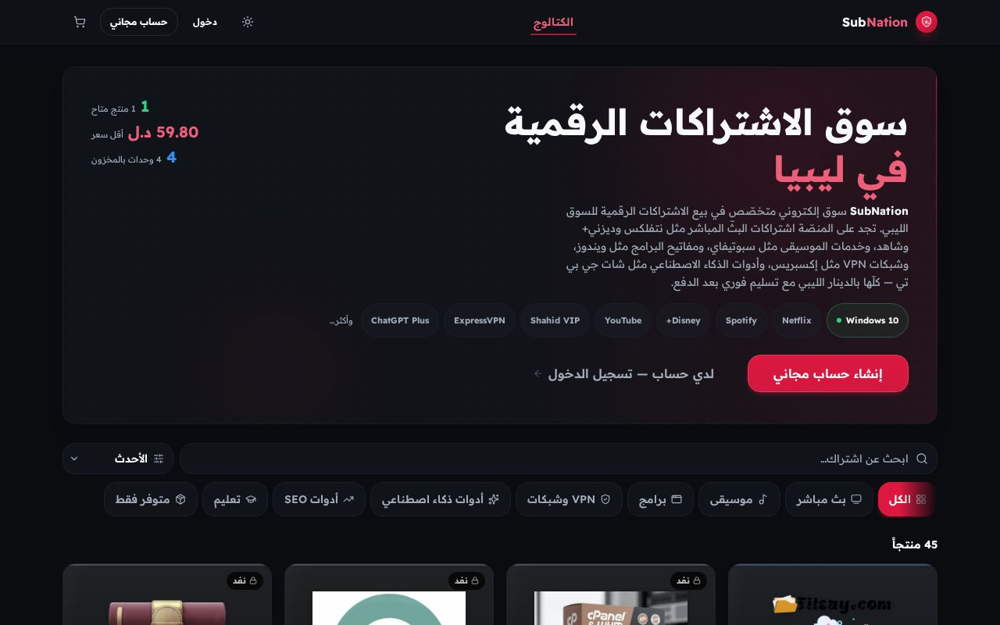
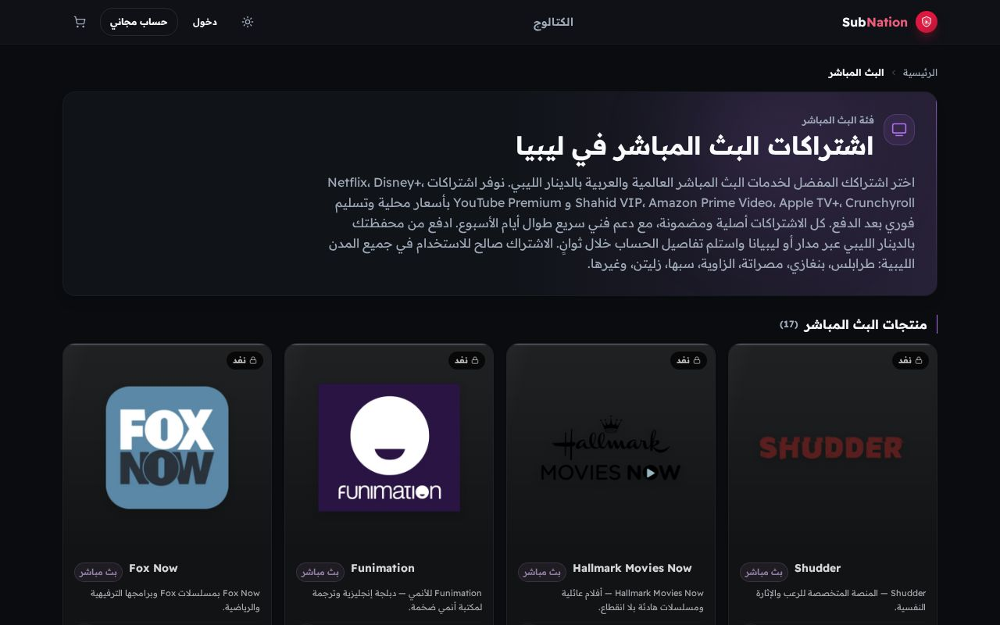
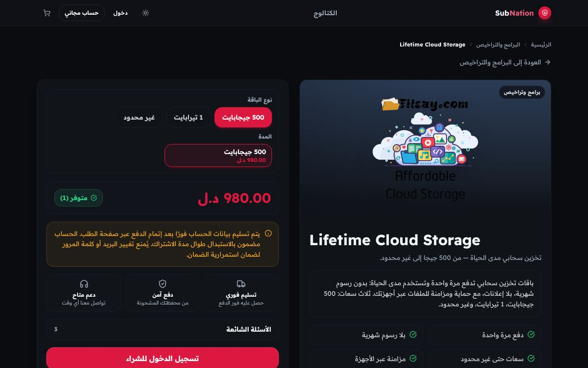

<div align="center">

# SubNation

**Arabic-first (RTL) digital-subscriptions marketplace for the Libyan market.**

Streaming, music, gaming and productivity subscriptions — bought with an in-app
wallet and delivered instantly with encrypted account credentials.

[](./docs/project-state/source-of-truth.md)
[](https://github.com/ahmadmedo1012/SubNation2/actions/workflows/ci.yml)
[](./LICENSE)
[](#tech-stack)
[](#local-development)
[](#local-development)

</div>

---

## What is this?

SubNation is a production-grade e-commerce platform where customers in Libya buy
digital subscriptions (Netflix, Spotify, PlayStation, Adobe, Microsoft 365, …).
It is **passwordless** for customers — sign in with **Google**, **Telegram**, or
**WhatsApp OTP** — top up an internal **wallet**, and receive subscription
credentials instantly after purchase. A full **admin panel** manages products,
inventory, orders, wallet top-ups, coupons, loyalty, referrals and support.

> **ما هذا المشروع؟** SubNation متجر إلكتروني عربي بالكامل — بواجهة
> من اليمين إلى اليسار — لبيع اشتراكات المنصّات الرقمية في السوق الليبي:
> نتفليكس، سبوتفاي، بلايستيشن، أدوبي، مايكروسوفت 365 وغيرها. يشتري العميل بدون
> كلمة مرور (عبر جوجل أو تيليجرام أو رمز تحقّق على واتساب) من رصيد محفظته
> داخل التطبيق، وتُسلَّم بيانات الاشتراك فورًا بعد الشراء مشفَّرة، مع لوحة
> إدارة شاملة للمنتجات والمخزون والطلبات والمحفظة والكوبونات والولاء
> والإحالات والدعم الفني.

> ✅ **Production is LIVE at <https://subnation.ly>** — self-hosted Docker on
> Coolify (Contabo VM) since the 2026-10 cutover, Neon Postgres external.
> Current truth: [`docs/project-state/source-of-truth.md`](./docs/project-state/source-of-truth.md) ·
> round-by-round history: [`CHANGELOG.md`](./CHANGELOG.md).

---

## Screenshots

Live from <https://subnation.ly> (Arabic RTL, desktop 1280×800):

[](./docs/assets/screenshots/storefront-home.jpg)

[](./docs/assets/screenshots/storefront-category.jpg)

[](./docs/assets/screenshots/storefront-product.jpg)

*Home · category catalog · product page — full-resolution JPEGs live in
[`docs/assets/screenshots/`](./docs/assets/screenshots/).*

## Highlights

- 🔐 **3 passwordless auth methods** — Google (Firebase), Telegram (widget + Mini App), WhatsApp OTP.
- 💳 **Internal wallet** with an append-only ledger and atomic, race-safe purchases.
- 📦 **Instant delivery** of inventory credentials, encrypted at rest (AES-256-GCM).
- 🎟️ Coupons, flash sales, loyalty tiers, and a referral program.
- 🛠️ **Rich admin panel** — products, orders, users, top-ups, pricing, security, alerts, observability.
- 🌍 **Arabic RTL** UI with a unified dark/light theme.
- 📈 Production-grade **observability** — Sentry (incl. lazy Session Replay), Prometheus metrics, structured logs, public `/status`.
- 🔒 Hardened security — Helmet/CSP, CORS allow-list, CSRF checks, multi-tier rate-limiting
  (Redis-backed when provisioned; in-process fallbacks in the no-Redis target topology), admin 2FA.

## How it works

1. **Sign in passwordless** — Google (Firebase), Telegram widget/Mini App, or
   WhatsApp OTP; the session is a JWT in an httpOnly cookie.
2. **Top up the wallet** — operator-approved top-ups (mobile transfer with a
   `payment_reference` guard, or manual admin credit) land in an append-only
   ledger; the balance is derived, never a mutable number.
3. **Buy** — checkout is one atomic transaction: wallet debit, single-writer
   inventory claim, coupon/loyalty pricing, order row — all-or-nothing,
   idempotent by `Idempotency-Key`.
4. **Instant encrypted delivery** — the purchased subscription credentials
   (AES-256-GCM at rest) appear in the order the moment it commits; domain
   events fire only after commit.
5. **Operate** — the admin panel (TOTP 2FA + RBAC scopes, every action
   audited) runs products, variants, inventory, orders/refunds, top-ups,
   coupons, flash sales, loyalty, referrals, tickets, security and
   observability.

System maps: [`docs/project-graph/00-system-overview.mmd`](./docs/project-graph/00-system-overview.mmd)
(13 mermaid truth maps in [`docs/project-graph/`](./docs/project-graph/)) ·
topology of record:
[`docs/architecture/FINAL_PRODUCTION_TOPOLOGY.md`](./docs/architecture/FINAL_PRODUCTION_TOPOLOGY.md).

---

## Tech stack

| Layer            | Technology                                                                                                                      |
| ---------------- | ------------------------------------------------------------------------------------------------------------------------------- |
| Frontend         | React 19, Vite, Tailwind CSS, wouter, TanStack Query (RTL, Arabic)                                                              |
| Backend          | Express 5, TypeScript, Socket.IO                                                                                                |
| Database         | PostgreSQL (Neon) via Drizzle ORM                                                                                               |
| Cache / realtime | Redis — **optional, not provisioned** (in-process rate-limit/cache/idempotency fallbacks; the single-instance scheduler mode needs no leader lock) |
| Auth             | Firebase Admin (Google), Telegram HMAC, WhatsApp OTP (OpenWA), JWT + httpOnly cookies                                           |
| Validation       | Zod — generated by orval from the OpenAPI spec (`shared/api-spec`)                                                              |
| Observability    | Sentry, Prometheus (`prom-client`), Pino                                                                                        |
| Deploy           | Docker (single image) on a self-hosted VM + Coolify — **live at `subnation.ly` since 2026-10** (host: Contabo VM); Neon stays external (see [status](#deployment-status-2026-10)). Render/Vercel are retired legacy |

---

## Repository layout

A **pnpm monorepo** — pnpm is enforced (installs via npm/yarn fail fast):

```
backend/    Express 5 API — routes, services, jobs, middlewares, idempotent boot migrations (src/migrate.ts)
frontend/   Vite + React 19 SPA (Arabic RTL) — pages, components, hooks; vitest suites + Playwright e2e
shared/     db (Drizzle schema + SQL mirror) · api-spec (OpenAPI) · api-zod + api-client-react (orval-generated) · error-codes
docs/       docs index (README.md) + 4-bucket tree (CURRENT/HISTORY/DEPRECATED/PENDING) + inspection-r###/ round reports (r124, r125, …)
deploy/     env.compose.example — full-stack Docker Compose contract (app + WhatsApp gateway)
scripts/    local orchestration (dev, seed, backup), cutover preflight, docker-verify
config/     env.example — the fully annotated environment reference
specs/      dated spec-driven working directories (spec / plan / priorities / checklists)
```

Root: `OPERATIONS_RUNBOOK.md` (on-call) · `CHANGELOG.md` (ledger) · `Dockerfile` + `docker-compose.yml`.

---

## Local development

- Node.js **22+** and pnpm **10+** (enforced by the workspace)
- A PostgreSQL database

```bash
pnpm install
cp config/env.example .env      # then edit DATABASE_URL (and SESSION_SECRET for prod)
pnpm run dev                    # boot migrations create/update the schema automatically
pnpm run db:seed                # default admin + sample products (idempotent; needs the dev server booted)
```

Open the printed local URL. Ports are only _preferences_ — the runner moves to
the next free port automatically and wires the Vite `/api` proxy for you.

### Tests

```bash
pnpm --filter @workspace/subnation run test:run        # frontend unit tests (vitest)
pnpm --filter @workspace/api-server exec vitest run    # backend unit tests
pnpm --filter @workspace/subnation run test:e2e        # guest-only Playwright smoke (needs a running stack)
```

Current suite (file counts verified at HEAD, R126; CI runs both unit suites
on every push): **frontend 159 test files / 1,076 tests** · **backend 234 test
files / 2,148 tests** (230 under `backend/src/**` + 4 under `backend/tests/`;
full-suite runs green in the R126 gates) · guest-only e2e **40/40** against
live production (20 spec flows × desktop + mobile-390 projects).

> **Schema note:** schema changes flow exclusively through the idempotent
> boot migrations (`backend/src/migrate.ts`), which the dev server runs
> automatically on every cold start — there is **no `db:push` step in the
> workflow**. The `drizzle-kit push` script still exists in the root
> `package.json` but **must never be run against production**: it generates
> SQL this schema rejects and can drop production-only tables (see
> `docs/history/deep-audit-2026-09-06.md`). `pnpm run db:seed` is idempotent
> and safe to re-run once the dev server has completed boot.

### Local PostgreSQL (any OS with Docker)

```bash
docker run -d --name subnation-pg \
  -e POSTGRES_USER=subnation -e POSTGRES_PASSWORD=<your-local-password> \
  -e POSTGRES_DB=subnation \
  -p 127.0.0.1:5432:5432 \
  -v subnation-pg-data:/var/lib/postgresql/data \
  postgres:16-alpine

# .env
DATABASE_URL=postgresql://subnation:<your-local-password>@127.0.0.1:5432/subnation
```

Redis is optional and unset in development — rate limiting, caching and the
scheduler fall back to the in-process / Postgres-lease paths automatically.

---

## Build & run (production)

```bash
pnpm run build                  # lint + typecheck + build API + build frontend (bundle budget gate enforced)
pnpm start                      # serves the API and the built SPA on one port ($PORT, default 8080)
```

The backend serves the built frontend from the **same origin**, so the simplest
deployment is a single Node process.

### Docker

```bash
cp config/env.example .env      # edit values
docker build -t subnation .
docker run -p 8080:8080 --env-file .env subnation
```

**Full stack with the WhatsApp gateway** (self-hosted / local — r107):

```bash
cp deploy/env.compose.example .env          # fill the required secrets
git clone https://github.com/ahmadmedo1012/openwa ../openwa
docker compose up -d --build                # subnation :3000 + openwa :3001 (localhost-bound)
```

Single-origin contract: leave `VITE_API_BASE_URL` / `VITE_SOCKET_URL` /
`VITE_API_URL` empty — the backend serves the SPA, the browser uses relative
`/api` paths and same-origin WebSockets. Verify a deployment with
`./scripts/docker-verify.sh` (build + health gate + graceful-drain proof;
`--arm64` cross-builds the ARM64 image — the original Oracle A1 target was
ARM64; the live host since 2026-10 is a Contabo VM).

### Self-hosted: Docker + Coolify (production since 2026-10)

The platform is hosting-agnostic (no Render/Vercel runtime coupling — r107
audit) and runs as the Docker images above behind Coolify on a self-hosted VM
(live host: Contabo; Neon stays external). `SINGLE_INSTANCE_MODE=true` runs
the schedulers ungated in-process with ZERO periodic Neon coordination
queries — see `deploy/env.compose.example`. Validate an env file before
deploying:
`pnpm --filter @workspace/scripts run validate:env -- --file .env --strict`.
Migration-era guides (historical): `docs/deprecated/COOLIFY_ORACLE_MIGRATION.md`,
`MIGRATION_RUNBOOK.md`, `FINAL_MIGRATION_READINESS.md`; architecture of record:
`docs/architecture/PRODUCTION_ARCHITECTURE.md` and
`docs/architecture/FINAL_PRODUCTION_TOPOLOGY.md`.

### Deployment status (2026-10)

- **Production is LIVE at <https://subnation.ly>** — self-hosted Docker on
  Coolify (Contabo VM) since the 2026-10-01/02 cutover, Neon Postgres
  external. **Coolify is the only deployment authority** (push-to-deploy:
  GitHub `main` → webhook → build → healthcheck-gated rolling update).
  Dated release record:
  [`docs/deployment/FINAL_SIGNOFF.md`](./docs/deployment/FINAL_SIGNOFF.md);
  topology of record:
  [`docs/architecture/FINAL_PRODUCTION_TOPOLOGY.md`](./docs/architecture/FINAL_PRODUCTION_TOPOLOGY.md).
  The pre-cutover Render/Vercel stack is retired legacy (evidence under
  `docs/history/`).
- **CI is green on every push** ([`.github/workflows/ci.yml`](./.github/workflows/ci.yml):
  secret scan, lint, typecheck, OpenAPI parity, migration + orval drift
  gates, both unit suites, production build). Round-by-round deployment +
  audit history: [`CHANGELOG.md`](./CHANGELOG.md) (latest deep rounds: R125
  admin-focused, R124 storefront — reports in
  [`docs/inspection-r125/`](./docs/inspection-r125/) and
  [`docs/inspection-r124/`](./docs/inspection-r124/)).
- **Nightly backups are automated** (`scripts/backup-cron.sh`) — see
  [`docs/DISASTER_RECOVERY.md`](./docs/DISASTER_RECOVERY.md).

---

## Performance

Live-measured; the full record — budgets, exact bytes, round history — lives
in [`docs/PERFORMANCE.md`](./docs/PERFORMANCE.md):

- **Lazy Sentry Session Replay** — the rrweb recorder loads only for recorded
  sessions (sticky 10% roll / first error) behind a real dynamic-import
  boundary; idle vendor chunk −30% (469,777 → 328,652 B raw).
- **Lazy admin charts** — recharts (134.7 KB gz) loads on demand; admin KPI
  routes paint without it and no longer pre-fetch the storefront home chunk.
- **Catalog list projection** — `GET /api/products?fields=list` omits the
  variant tree + usage terms: −62.6% of the catalog wire bytes.
- **Route-chunk warm-up** — pointerenter/focusin delegation pre-imports the
  likely-next route (−150–400 ms perceived nav on 3G/4G), saveData-respecting.
- **Eager path ≈ 143 KiB gz** (entry + vendor + CSS) under a CI budget gate —
  145 KiB warn / 160 KiB hard-fail, enforced by the production build.

---

## Configuration

All runtime config flows through a single `.env` file — copy
`config/env.example` and edit; you should never need to change code to
switch host, port, or domain. Most important keys:

| Key                              | Purpose                                                                                                                                |
| -------------------------------- | ------------------------------------------------------------------------------------------------------------------------------ |
| `DATABASE_URL`                   | Postgres connection string (**required**)                                                                                              |
| `SESSION_SECRET`                 | JWT signing secret (**required in prod**, ≥ 32 chars)                                                                                  |
| `ENCRYPTION_KEY`                 | AES-256-GCM key (64 hex chars) for inventory credentials                                                                               |
| `ENCRYPTION_KEY_PREV`            | Optional decrypt-only rotation fallback for `ENCRYPTION_KEY` — set only during rotation, drop after the re-encrypt job drains the old blobs (see `config/env.example`) |
| `REDIS_URL`                      | Redis connection (**optional** — unset in the target topology; rate-limit/cache/idempotency degrade to in-process fallbacks; the single-instance scheduler mode needs no lease) |
| `APP_URL` / `APP_ORIGINS`        | Public origin and CORS allow-list                                                                                                      |
| `FIREBASE_*` / `VITE_FIREBASE_*` | Enable Google Sign-In                                                                                                                  |
| `TELEGRAM_BOT_TOKEN`             | Operational notifications (Telegram **login** is configured in the admin UI)                                                           |
| `WHATSAPP_OTP_*`                 | OpenWA gateway for WhatsApp OTP                                                                                                        |

See `config/env.example` for the full annotated reference.

For pairing and removing the WhatsApp OTP session, see
[`docs/WHATSAPP_OPERATIONS.md`](./docs/WHATSAPP_OPERATIONS.md).

---

## Main API routes

```
GET  /api/healthz                  POST /api/orders
POST /api/auth/firebase/session    GET  /api/wallet
POST /api/auth/telegram            GET  /api/products (?fields=list for grid views)
POST /api/auth/whatsapp/start      GET  /api/admin/stats
POST /api/auth/whatsapp/verify     GET  /api/auth/me
```

Generated hooks (`shared/api-client-react`) and validation schemas
(`shared/api-zod`) are orval-generated from `shared/api-spec/openapi.yaml`
and kept drift-free by CI.

---

## Documentation

| Document | What it covers |
| -------- | -------------- |
| **[`OPERATIONS_RUNBOOK.md`](./OPERATIONS_RUNBOOK.md)** | 📌 **Start here (on-call)** — alert triage, dashboards, rollback, Sentry/Telegram/edge (§11–§13), backups |
| **[`CHANGELOG.md`](./CHANGELOG.md)** | Round-by-round release ledger, newest first |
| **[`docs/README.md`](./docs/README.md)** | 📚 **Docs index** — CURRENT / HISTORY / DEPRECATED / PENDING for every doc |
| **[`docs/ONBOARDING.md`](./docs/ONBOARDING.md)** | 🚀 **Start here (developers)** — the ordered path: repo map → setup → law docs → gates → round records |
| [`docs/FINAL_MONEY_INVARIANTS.md`](./docs/FINAL_MONEY_INVARIANTS.md) | The money law — M1–M14 invariants every wallet/checkout change must obey |
| [`docs/PERFORMANCE.md`](./docs/PERFORMANCE.md) | The performance record — budgets, measured numbers, round history |
| [`docs/project-graph/`](./docs/project-graph) | 13 mermaid truth maps — system overview, data model, deployment chain, source of truth |
| [`docs/architecture/FINAL_PRODUCTION_TOPOLOGY.md`](./docs/architecture/FINAL_PRODUCTION_TOPOLOGY.md) · [`PRODUCTION_ARCHITECTURE.md`](./docs/architecture/PRODUCTION_ARCHITECTURE.md) | Topology + capacity of record |
| [`docs/DISASTER_RECOVERY.md`](./docs/DISASTER_RECOVERY.md) | Backup/restore and incident recovery |
| [`docs/API.md`](./docs/API.md) | API reference |
| [`docs/history/PROJECT_OVERVIEW.md`](./docs/history/PROJECT_OVERVIEW.md) · [`docs/history/PLATFORM.md`](./docs/history/PLATFORM.md) | Historical architecture snapshots (2026-08-25 Arabic · 2026-09-02) |

## Contributing · Security · License

- **Contributing** — workspace setup, the gates to run before a PR, commit
  and round-report conventions: [`CONTRIBUTING.md`](./CONTRIBUTING.md)
- **Security** — how to report a vulnerability (privately, please) and what's
  in scope: [`SECURITY.md`](./SECURITY.md)
- **License** — MIT: [`LICENSE`](./LICENSE)

---

## Notes

- The `ruflo/` directory (optional multi-agent dev tooling) is gitignored and is
  **not** required to build, run, or deploy SubNation.
